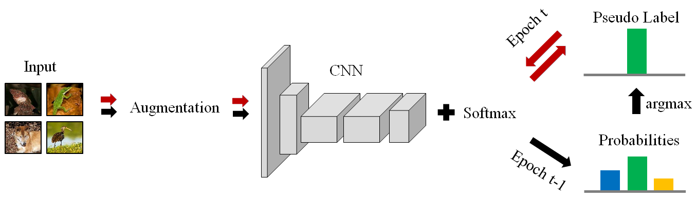

# Unsupervised Image Classification [PDF](https://arxiv.org/pdf/2006.11480v2.pdf)
Weijie Chen, Shiliang Pu, Di Xie, Shicai Yang, Yilu Guo, Luojun Lin. In ECCVW 2020.

## Prerequisites
* python3.6
* pytorch1.1

## UIC Pipeline


TLDR: UIC is a very simple self-supervised learning framework for joint image classification and representation learning. It utilizes the forward result at epoch t-1 as pseudo label to drive unsupervised training at epoch t.

## Getting Started

### Data Preparation
Link your own ImageNet dataset to [./data/ImageNet/train](./data/ImageNet/train) and [./data/ImageNet/val](./data/ImageNet/val) with the format of datasets.ImageFolder in Pytorch.

### Unsupervised Training
```
$ sh ./main.sh
```

### Linear Evaluation
```
$ sh ./eval_linear.sh
```

## License
You can view in [License](./LICENSE).

## Citation
If you find our code useful, please consider citing our paper:

```
@InProceedings{chen2020unsupervised,
  title={Unsupervised Image Classification for Deep Representation Learning},
  author={Chen, Weijie and Pu, Shiliang and Xie, Di and Yang, Shicai and Guo, Yilu and Lin, Luojun},
  booktitle={European Conference on Computer Vision Workshop},
  pages={430-446}
  year={2020},
  organization={Springer}
}
```

## Acknowledgements
Our code is implemented based on [DeepCluster](https://github.com/facebookresearch/deepcluster).

## Contact
If you are interested in internship, or applied researcher / developer positions in Hikvision Research Institute, please feel free to seed an email to chenweijie5 -at- hikvision.com.
